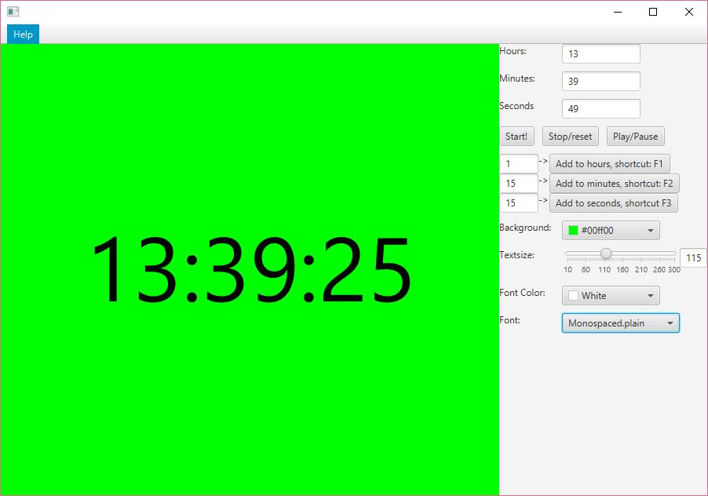

# Countdown-timer
A quick and dirty java application made for a friends friend to work as a simple countdown timer with editable parameters.
This is purely personal project but you are free to do whatever you want with this code but since its for personal use (and I used about an hour on it),
not much effort was put into formatting and coding style 

You can just pick runnable jars from the release directory.

